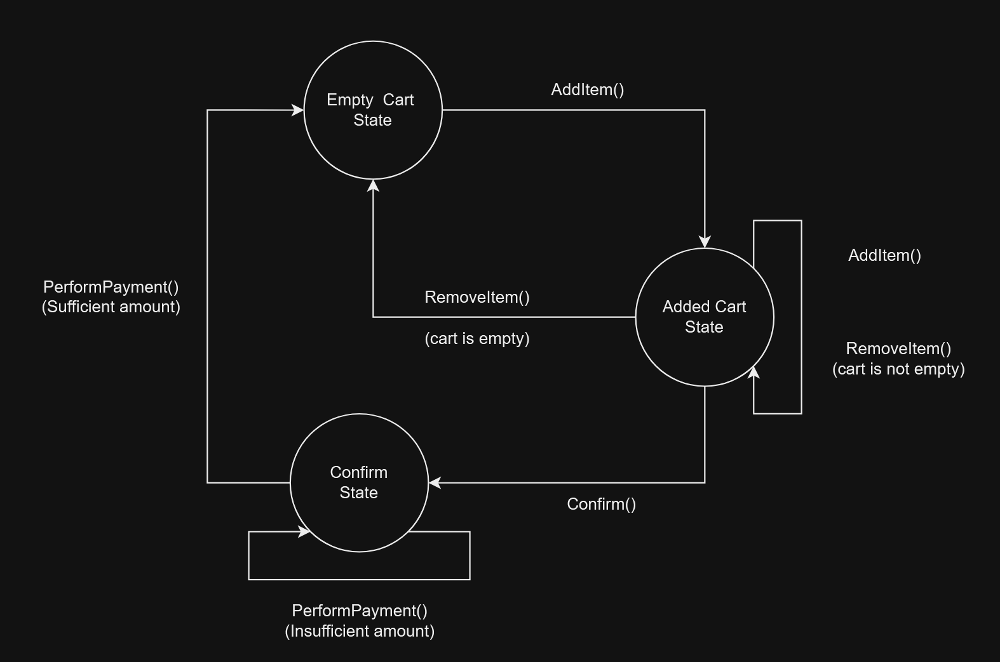
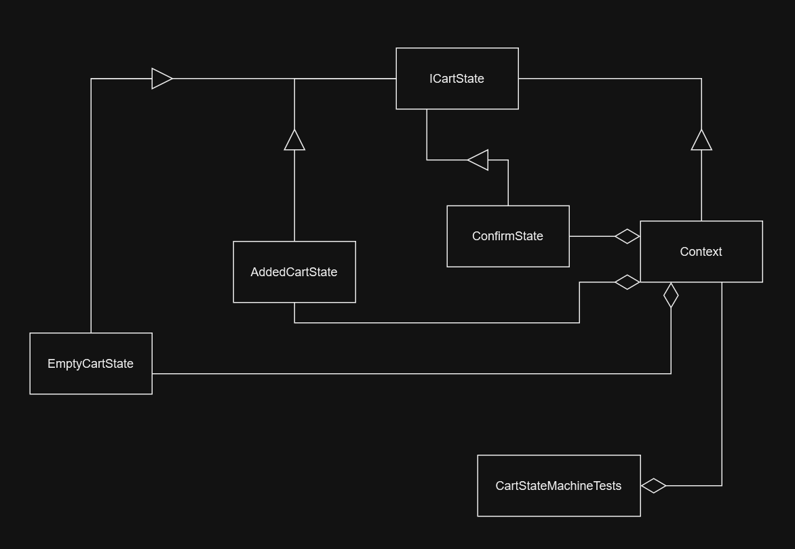

# OnlineShoppingCart

## Overview
**OnlineShoppingCart** This is an example of an Online Shopping Cart application implemented using the State Design Pattern. The application allows customers to add items to their shopping cart, remove items, confirm their order, and make payments. The state design pattern is employed to manage the transitions and behavior of the shopping cart as it progresses through various states during the shopping process.  
The **State Design Pattern** is employed to ensure that the shopping cart behaves differently depending on its state. The key states and their responsibilities are defined in the `ICartState` interface.

## Features
The shopping cart follows the State Design Pattern to transition between different states, namely empty, not empty and confirmed. Each state defines specific behavior and rules.

Add and Remove Items: Customers can add items to their cart, specifying the quantity. They can also remove items if needed.

Confirm Order: Once customers are satisfied with their selection, they can confirm their order. This locks the cart and prevents further changes.

Payment Processing: After confirmation, customers can make payments for the items in their cart. The application supports various payment methods.

### Attributes and Functions

`errorStatus` : True if the last function had some execution error.  
`errorMessage` : The Message related with the last executed error.  
`GetCartItems()`: Retrieves the items in the cart.  
`GetStoreItems()`: Retrieves the available items in the store.  
`GetStoreRates()`: Retrieves the prices of items in the store.  
`AddItem()`: Adds an item to the cart.  
`RemoveItem()`: Removes an item from the cart.  
`Confirm()`: Confirms the order, transitioning the cart to the confirmed state.  
`PerformPayment()`: Processes the payment, transitioning the cart to the paid state.  

### States

`EmptyCartState` : Cart is empty. Only transition possible is to `AddedCartState`  
`AddedCartState` : Cart has a few added items. Items can be removed, further items can be added, or order can be confirmed  
`ConfirmState` : Order has been confirmed. If the right amount of payment is made, the cart will be emptied and the corresponding items from the store will be taken off

### Context
Context is a class derived of the interface `ICartState` which handles the state transitions.

## Design

### State Diagram

### Dependency Diagram

# Environment
The project builds and runs with Visual Studio Community 2022.